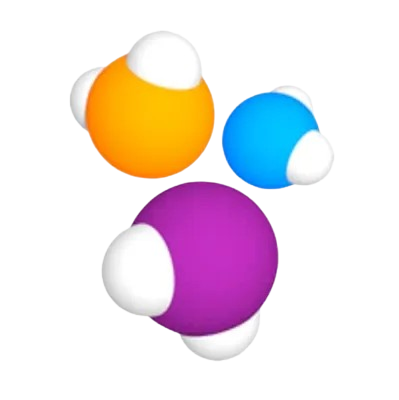
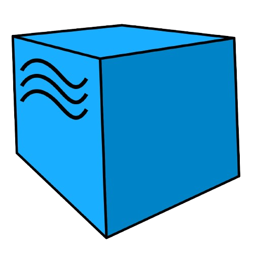

<p align="center">
  <a href="https://coffeelogia.kz/" target="_blank">
    
  </a>
</p>

# Проект по автоматизации тестирования для сайта компании [Coffeelogia](https://coffeelogia.kz/)

## :coffee: Содержание
- [Технологический стек](#coffee-технологический-стек)
- [Детальное описание](#coffee-детальное-описание)
- [Реализованные проверки](#coffee-реализованные-проверки)
- [Запуск тестов](#coffee-запуск-тестов)
- [Allure-отчет](#coffee-Allure-отчет)
- [Уведомления в Telegram](#coffee-уведомления-в-telegram)

## :coffee: Технологический стек

<div align="center">
  <table>
    <tr>
      <td align="center" width="110">
        <a href="https://www.java.com/" target="_blank">
          
        </a><br>Java
      </td>
      <td align="center" width="110">
        <a href="https://gradle.org/" target="_blank">
          
        </a><br>Gradle
      </td>
      <td align="center" width="110">
        <a href="https://junit.org/junit5/" target="_blank">
          
        </a><br>JUnit 5
      </td>
      <td align="center" width="110">
        <a href="https://selenide.org/" target="_blank">
          
        </a><br>Selenide
      </td>
      <td align="center" width="110">
        <a href="https://docs.qameta.io/allure/" target="_blank">
          
        </a><br>Allure
      </td>
      <td align="center" width="110">
        <a href="https://www.jenkins.io/" target="_blank">
          
        </a><br>Jenkins
      </td>
      <td align="center" width="110">
        <a href="https://github.com/aerokube/selenoid" target="_blank">
          
        </a><br>Selenoid
      </td>
      <td align="center" width="110">
        <a href="https://github.com/" target="_blank">
          
        </a><br>GitHub
      </td>
      <td align="center" width="110">
        <a href="https://telegram.org/" target="_blank">
          
        </a><br>Telegram
      </td>
    </tr>
  </table>
</div>


## :coffee: Детальное описание

:diamonds: Тесты написаны на языке программирования **Java** с использованием фреймворка **Selenide**  
:diamonds: Сборка проекта осуществляется через **Gradle**  
:diamonds: Запуск тестов производится через **Jenkins** удаленно в контейнерах **Selenoid**  
:diamonds: Реализовано формирование отчетов через **Allure** с отправкой через чат-бота в **Telegram**  

---

## :coffee: Реализованные проверки

:diamonds: Проверка загрузки и отображения элементов главной страницы  
:diamonds: Проверка отображения опций навигационного меню  
:diamonds: Проверка отображения элементов страницы Блог  
:diamonds: Проверка наличия карточек товара из случайной страны  
:diamonds: Проверка добавления товара в корзину  

---

## :coffee: Запуск тестов

Реализован параметризированный запуск тестов, параметры:

:diamonds: Категория тестов, все тесты разделены на 2 категории, магазин и общая работоспособность  
:diamonds: Расширение браузера  
:diamonds: Адрес для удаленного запуска  
:diamonds: Логин и пароль для удаленного запуска  

<details>
  <summary>Детальнее про параметры</summary>  

#### :tea: Для запуска по категориям необходимо использовать соответствующее задание, всего их создано три:

| Категория                     |    Общие     |    Магазин | Все тесты |
|-------------------------------|:------------:|-----------:|----------:|
| Тэг                           |    Global    |       Shop |         - |
| Параметр локального запуска   | global_tests | shop_tests | all_tests |
| Параметр запуска из Дженкинса |    Общие     |    Магазин |       Все |

#### :tea: Расширение браузера - задано три фиксированных варианта при запуске из дженкинса:

:diamonds: 1920х1080  
:diamonds: 1280х720  
:diamonds: 1024х768  

При запуске локально можно указать любое произвольное значение, либо не указывать его вовсе, значение по умолчанию - 1920х1080.

#### :tea: Адрес и данные для входа - опциональные параметры, при их отсутствии тесты можно запускать локально без селеноида.

</details>

<details>
  <summary>Примеры локального запуска</summary>

#### Команды для bash:  

```bash
./gradlew clean all_tests
```

```bash
./gradlew clean shop_tests -DbrowserSize="1024x768"
```
</details>

<details>
  <summary>Пример удаленного запуска через Jenkins</summary>  

#### [Перейти в Jenkins](https://jenkins.autotests.cloud/job/C35-oshkamoshka-HW14/) и указать параметры:


</details>

---

## :coffee: Allure отчет

Глобальный отчет по всем удаленным запускам хранится на сервере, ссылка: [Allure-отчет](https://jenkins.autotests.cloud/job/C35-oshkamoshka-HW14/allure/)

### :tea: Главная страница Allure-отчета


### :tea: Детальный разбор отчета
Отчет содержит:  

:diamonds: Шаги теста  
:diamonds: Скриншот страницы на последнем шаге  
:diamonds: Page Source  
:diamonds: Логи браузерной консоли  
:diamonds: Видео прогона автотестов  
  
<details>
  <summary>Пример детального отображения</summary>

</details>

<details>
  <summary>Пример видео</summary>
<p align="center">
  
</p>
</details>

## :coffee: Уведомления в Telegram

После завершения сборки, бот, созданный в Telegram, автоматически обрабатывает и отправляет сообщение с результатом.
Пример сообщения:

<p align="center">

</p>